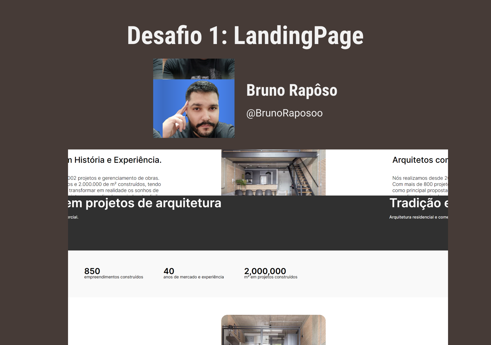

<h1 align="center"> DESAFIO 1 - Landing page - DNC </h1>

  <a href="#-tecnologias">Tecnologias</a>&nbsp;&nbsp;&nbsp;|&nbsp;&nbsp;&nbsp;
  <a href="#-projeto">Projeto</a>&nbsp;&nbsp;&nbsp;|&nbsp;&nbsp;&nbsp;
  <a href="#-layout">Layout</a>&nbsp;&nbsp;&nbsp

 

  

## 🚀 Tecnologias

Esse projeto foi desenvolvido com as seguintes tecnologias:

- [JavaScript](https://www.javascript.com/)
- [HTML](https://developer.mozilla.org/pt-BR/docs/Web/HTML)
- [CSS](https://developer.mozilla.org/pt-BR/docs/Learn/Getting_started_with_the_web/CSS_basics)
- [SheetMonkeys](https://sheetmonkey.io/)

## 💻 Projeto

Projeto de desenvolvimento de uma landing page para o desafio 1 do curso de formação em técnologia da DNC

link do site disponibilizado. [Clique aqui](https://candid-cascaron-4c8d0c.netlify.app/) ou acesse em: https://candid-cascaron-4c8d0c.netlify.app/  
link da [planilha](https://docs.google.com/spreadsheets/d/1ah-Rp7f3jkn4JDNzkPRlqbJ6kbogJa_JATOQ3wVeyv8/edit#gid=0) de registro de informações  ou acesse em: https://docs.google.com/spreadsheets/d/1ah-Rp7f3jkn4JDNzkPRlqbJ6kbogJa_JATOQ3wVeyv8/edit#gid=0

## 🔖 Layout

Você pode visualizar o layout do projeto através [DESSE LINK](https://www.figma.com/file/0FRiZbs30dfSniazKiM1rM/Desafio-1---Desenvolva-uma-Landing-Page?type=design&node-id=1-3&mode=design&t=Q9PoPB1sVJHI91W3-0). É necessário ter conta no [Figma](https://figma.com) para acessá-lo.